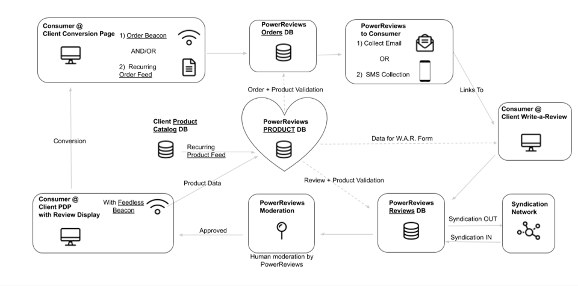

# Dados de produto e pedido

Em um alto nível, os dados de produtos e dados de pedidos são os dois componentes mais críticos que impulsionam o sucesso de um programa de Conteúdo Gerado pelo Usuário ("UGC"). Sem eles, sua solução de coleta e exibição da UGC, conforme diagramado abaixo, não será capaz de proporcionar o máximo impacto nos negócios. Você pode injetar seus dados de produto e pedido na solução PowerReviews de duas maneiras: feeds ou sinalizadores JavaScript. Ambos os métodos são robustos e confiáveis, e em uso por um grande número de clientes.

Considerações para qual método pode ser melhor para sua solução podem ser encontradas nos dois documentos a seguir. Entre em contato com o gerente de sucesso do cliente ou gerente de implementação para discutir as possibilidades e começar.

**PowerReviews Diagrama de solução UGC**

Seu catálogo de produtos é a informação mais importante necessária pelo PowerReviews para implementar os seguintes componentes do software PowerReviews:

* **Write-A-Review form** (Formulário de gravação a-revisão): o formulário Write-A-Review usa seu catálogo de produtos para exibir o nome do produto, a imagem e a URL da página durante todo o processo de envio de revisão do cliente.
* **Template Mapping** (Mapeamento de modelos): O mapeamento de modelos usa seu catálogo de produtos para mapear seus produtos para um modelo de revisão específico de categoria, para uma experiência de escrita de revisão mais contextual para seus clientes.
* **Questions & Answers** (Perguntas & Respostas): O software Q &A usa seu catálogo de produtos para incluir o nome do produto e a imagem do produto quando um cliente está fazendo uma pergunta ou fornecendo uma resposta.
* **Syndication** (Sindicato): PowerReviews O Sindicato usa seu Catálogo de Produtos para compartilhar avaliações entre marcas e varejistas, combinando dados do produto.

Order data is critical to your PowerReviews solution success to drive the following:

**Novo UGC**: O principal driver da nova UGC é uma pedido que aciona um e-mail ou SMS pedindo ao consumidor para deixar uma revisão, carregar conteúdo social, etc.

**Relatório**: Permite o relatório "Influência de vendas" mostrando # de pedidos e taxas de conversão com vs sem avaliações.

Considerations for which method might be best for your solution can be found in these two documents. Please contact your Customer Success Manager or Implementation Manager to discuss the possibilities and get started.

* Opções e considerações de dados de produtos
* Opções e considerações de dados de pedidos

> :warning: Entre em contato com o gerente de sucesso do cliente ou com o gerente de projetos de implementação para começar.
